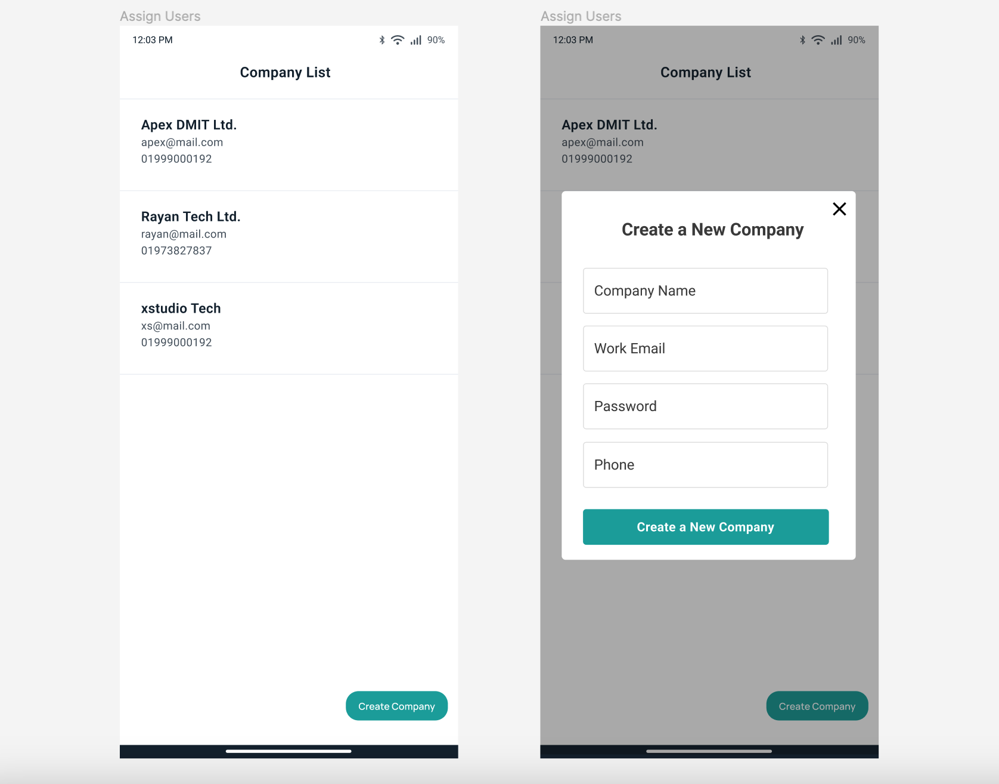

# company

A new Flutter company project.

<h1> Clean Architecture Pattern</h1>

  <h2>Technology specification  </h2>
  <h3>Frontent Architecture: stacked </h3>
  <h3>API intregation: retrofit,retrofit_generator,dio</h3>
   <h3>Dependency Injection: getX,injectable,injectable_generator</h3>
   <h3>Data Bindings : json_annotation,json_serializable,result_monad</h3>
      <h3>Error Handling: Interceptor Dio</h3>
   
  

  <h2>flutter doctor</h2>
Doctor summary (to see all details, run flutter doctor -v):
[✓] Flutter (Channel stable, 3.7.12, on macOS 13.2.1 22D68 darwin-arm64, locale en)
[✓] Android toolchain - develop for Android devices (Android SDK version 30.0.3)
[✓] Xcode - develop for iOS and macOS (Xcode 14.3)
[✓] Chrome - develop for the web
[✓] Android Studio (version 2021.3)
[✓] VS Code (version 1.75.1)
[✓] Connected device (2 available)
[✓] HTTP Host Availability

A few resources to get you started if this is your first Flutter project:

- [Lab: Write your first Flutter app](https://docs.flutter.dev/get-started/codelab)
- [Cookbook: Useful Flutter samples](https://docs.flutter.dev/cookbook)

For help getting started with Flutter development, view the
[online documentation](https://docs.flutter.dev/), which offers tutorials,
samples, guidance on mobile development, and a full API reference.
